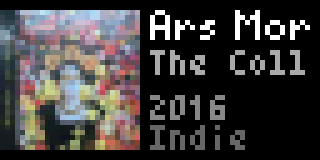

# Vinyl Roulette - Tidbyt App

Display a random vinyl from your Discogs collection on your Tidbyt device!

## Features

- 🎵 Shows a random album from your Discogs collection
- 🖼️ Displays album artwork (thumbnail)
- 📝 Shows artist name and album title (with marquee scrolling for long names)
- 🔢 Shows track count and total album duration
- ⏱️ Caches data to minimize API calls (6-hour refresh)
- 📂 Filters by folder ID (default `f_0` = all folders; `f_<id>` for a specific folder)
- 🔄 Retries until it finds a vinyl entry
- 📊 Optional "stats" carousel with album count, total duration, and average duration

## What You'll Need

1. **A Tidbyt device** (obviously!)
2. **A Discogs account** with some records in your collection
3. **A Discogs Personal Access Token**

## Setup Instructions

### Step 1: Get Your Discogs Personal Access Token

1. Log into [Discogs](https://www.discogs.com)
2. Go to **Settings** → **Developers** (or visit [discogs.com/settings/developers](https://www.discogs.com/settings/developers))
3. Click **"Generate new token"**
4. Copy the token - you'll need it to configure the app

## How It Works

1. **First API call**: Fetches your collection metadata (total count)
2. **Random selection**: Picks a random page and item index
3. **Second API call**: Fetches that page of your collection
4. **Third API call**: Fetches full release details for track count/duration
5. **Caching**: Collection metadata cached for 6 hours, release details for 24 hours

## API Rate Limits

Discogs API allows:
- **60 requests/minute** for authenticated users
- The app makes 2-3 requests per refresh (well within limits)

## Troubleshooting

**"Set Discogs username" error:**
- Make sure you're passing the username parameter correctly

**"API error: 401":**
- Your token may be invalid or expired
- Generate a new token at discogs.com/settings/developers

**"Collection is empty":**
- Make sure your Discogs collection has records
- Check that your collection privacy is set to public (or you're using the correct token)

**No album art showing:**
- Some releases don't have images
- The app falls back to text-only layout

## Files

- `vinyl_roulette.star` - The main app code
- `README.md` - This file

## Credits

- Discogs API: https://www.discogs.com/developers/
- Tidbyt/Pixlet: https://tidbyt.dev

---

Enjoy your random vinyl discoveries! 🎶
